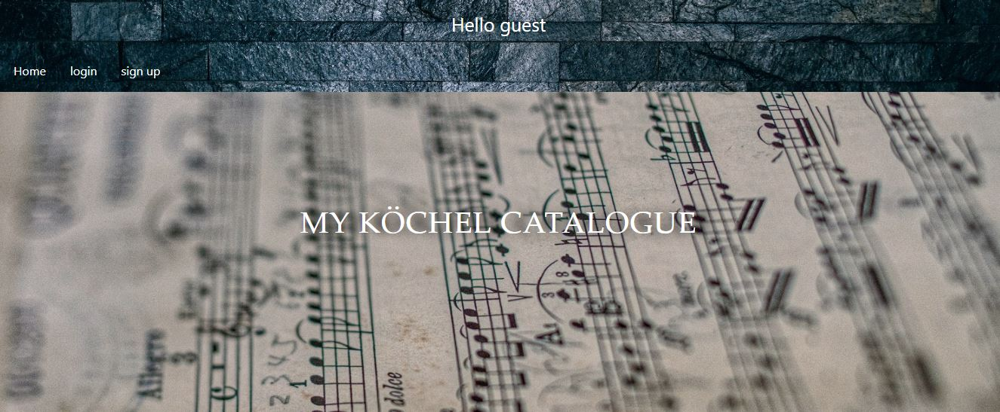
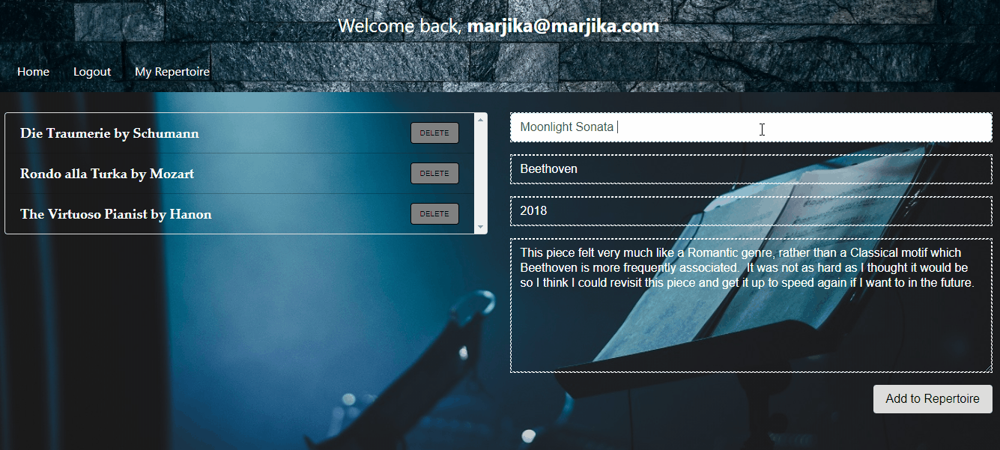

### My Köchel Catalogue
> A place for musicians to record and make notes on the music they know and the music they want to learn.

## Development Process
I used a repo with a basic login authentication (described below under MERN + Passport.js) and found at https://github.com/thechutrain/mern-passport in order to have structure to give each user a unique catalog of music that he or she can store and comment on.  Besides the home page/route ("/") and signup/login, there are routes for adding new music to the catalog ("/addMusic") and for reading and editing the comment on individual pieces of music ("/edits/:id").

## Database
The base project connects to a Mongo database and comes with a "user" model and can be adapted for a google auth.  You will need to add a .env file to run in development mode with Google Client Id and Secret keys, but these can be dummy numbers to start and changed to real keys if you decide to use Google login.  I added the "repertoire" model, with title, composer, time frame, and notes properties, and the notes may be added to or changed through _findOneAndUpdate_ method. The user can add and delete the individual pieces of music.

## Homepage and application operation





#### About 
My Köchel Catalogue was created in October 2018-January 2019.  This application uses the MERN model and must have access to a database to be hosted.  It is hosted at .  My Köchel Catalogue was created and maintained by me, Marjika Howarth.


##NOTE
_The following is from the MERN passport github README._
### MERN + Passport.js
> example MERN stack application that uses authentication

* Mongo, Express, React, Node (MERN) + Passport.js for managing authentication
* This project was bootstrapped with [Create React App](https://github.com/facebookincubator/create-react-app).

## Demo


View the live version of this app here:
[https://mern-passport.herokuapp.com/](https://mern-passport.herokuapp.com/)

## Project Structure
```
|-- server/
|  |-- server.js                            // The entry point for running the backend server locally, and main server for production
|  |-- passport/                             // Configuration files used to connect to different machines or set settings
|     |-- index.js                     // Overloads the passport object and defines serialize and deserialize
|     |-- localStrategy.js            // Defines a local strategy
|     |-- googleStrategy.js           // Defines google OAuth stratgey
|     ....
|  |-- db/                             
|     |-- index.js                  // Configures the connection to the database
|     |-- models/                   // represents data from our database, and defines schemas for each collection
|        |-- user.js                // Schema for the User collection
| -- src/                           // Entry for the React client side application
```

## Note
* In order to set the google authentication up, you must register your app @ [https://console.developers.google.com](https://console.developers.google.com) & set `GOOGLE_CLIENT_ID` & `GOOGLE_CLIENT_SECRET` as environmental variables
* In development mode (i.e. `npm run dev`), OAuth google callback is not being proxied to the google servers. Therefore in order to test the google OAuth on your local machine do the following:
1) `npm run build`
2) `npm run prod`
